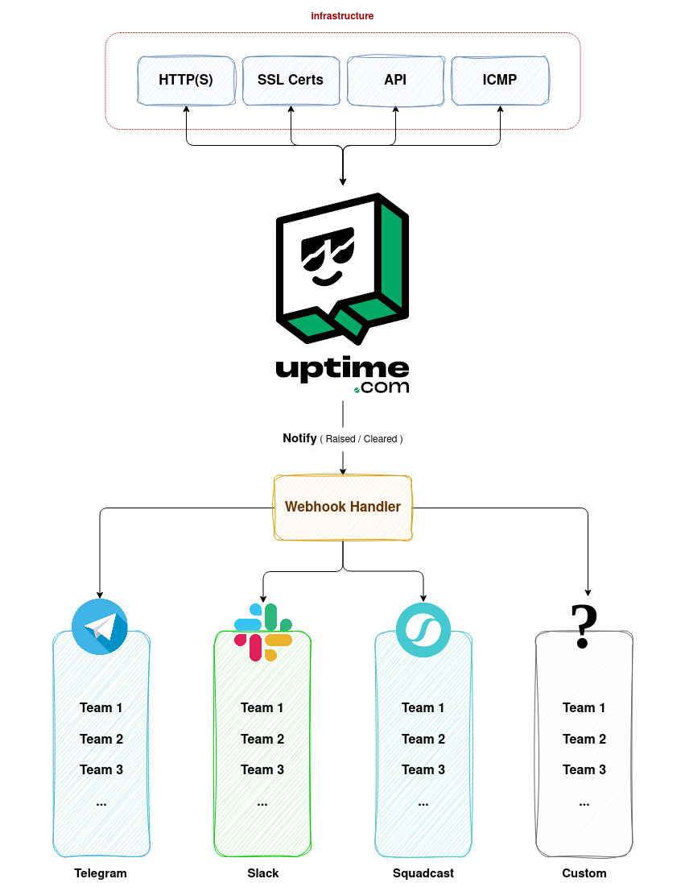
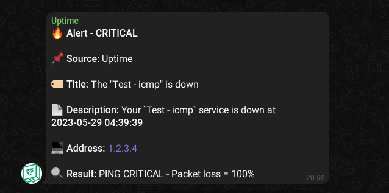

# Uptime webhook handler

[![Release][release_badge]][release_link]
[![License][badge_license]][link_license]
[![Image size][badge_size_latest]][link_docker_hub]

- [Uptime webhook handler](#uptime-webhook-handler)
  - [Installation](#installation)
  - [Notifiers](#notifiers)
    - [Squadcast](#squadcast)
    - [Telegram](#telegram)
    - [Slack](#slack)
    - [Custom Webhook](#custom-webhook)
  - [Monitoring](#monitoring)
  - [Support 💛](#support-)
  - [Contributing 🤝](#contributing-)
  - [Issues](#issues)

It's webhook handler for [uptime.com](https://uptime.com). You can define multiple teams and multiple notifiers for each team.

1. Uptime.com will monitor our targets ( HTTP/S - ICMP - DNS - API - ... )
2. Notify our webhook after making a decision
3. Our webhook handler will send the final alert based on teams and any enabled platform.



## Installation

1. Create your configuration file. You can use [`config.yml.example`](./configs/config.yml.example) as a template.
2. Add your Squadcast configuration to the `config.yml` file.
3. Run `docker-compose up -d` to start the service or run it manually:

   ```bash
   docker run -d \
       --name uptime-webhook \
       -p 8080:8080 \
       -v /path/to/config.yml:/app/configs/config.yml \
       hatamiarash7/uptime-webhook:latest
   ```

4. Go to Uptime dashboard and create a new webhook in *Notifications / Integrations* section.
5. Use your deployed webhook URL like this:

   ```text
   http://<your-host>:8080/api/v1/alert/
   ```

6. Wait for alerts 😁 Or you can send a test alert in Uptime dashboard.

## Notifiers

You can use multiple notifiers at the same time. Just define them to the `config.yml` file. There is a [config.yml.example](./configs/config.yml.example) file in the `configs` directory. You can use it as a template.

### Squadcast

1. Create a new Service in Squadcast ( Or use an existing one )
2. Use `Incident Webhook` as an alert source
3. Define that in `config.yml` file

   ```yaml
   notifier:
      squadcast:
         enable: true
         teams:
            team1: "<WEBHOOK-URL>"
            team2: "<WEBHOOK-URL>"
   ```

   

### Telegram

Fill your `notifier` with a `telegram` section like this:

```yaml
notifier:
   telegram:
      enable: true
      host: "https://api.telegram.org/bot"
      token: "1234:ABCD"
      teams:
         team1:
            - chat: "-123456789"
         team2:
            - chat: "-124564"
              topic: "56789"
```



### Slack

1. Create a new Application in Slack
2. Use `Incoming Webhook` as type
3. Define the webhook in `config.yml` file

   ```yaml
   notifier:
      slack:
         enable: true
         teams:
            team1: "<WEBHOOK-URL>"
            team2: "<WEBHOOK-URL>"
   ```

   

### Custom Webhook

Fill your `notifier` with a `custom` section and put your webhook URL like this:

```yaml
notifier:
   custom:
      enable: true
      teams:
         team1: "<WEBHOOK-URL>"
         team2: "<WEBHOOK-URL>"
```

## Monitoring

We have some metrics for monitoring our service in `/metrics` path.

| Metric name                              | Description                                      |
| ---------------------------------------- | ------------------------------------------------ |
| `UPTIME_webhook_total_alerts`            | Total number of alerts                           |
| `UPTIME_webhook_telegram_success`        | Total number of successful Telegram notify       |
| `UPTIME_webhook_telegram_failure`        | Total number of failure Telegram notify          |
| `UPTIME_webhook_squadcast_success`       | Total number of successful Squadcast notify      |
| `UPTIME_webhook_squadcast_failure`       | Total number of failure Squadcast notify         |
| `UPTIME_webhook_slack_success`           | Total number of successful Slack notify          |
| `UPTIME_webhook_slack_failure`           | Total number of failure Slack notify             |
| `UPTIME_webhook_custom_success`          | Total number of successful Custom Webhook notify |
| `UPTIME_webhook_custom_failure`          | Total number of failure Custom Webhook notify    |
| `UPTIME_webhook_alert_pool_capacity`     | The alert pool capacity                          |
| `UPTIME_webhook_alert_pool_running_jobs` | Total number of active jobs in alert pool        |

---

## Support 💛

[](https://donatebadges.ir/donate/Bitcoin/bc1qmmh6vt366yzjt3grjxjjqynrrxs3frun8gnxrz)

[](https://donatebadges.ir/donate/Ethereum/0x0831bD72Ea8904B38Be9D6185Da2f930d6078094)

<div><a href="https://payping.ir/@hatamiarash7"></a></div>

## Contributing 🤝

Don't be shy and reach out to us if you want to contribute 😉

1. Fork it!
2. Create your feature branch: `git checkout -b my-new-feature`
3. Commit your changes: `git commit -am 'Add some feature'`
4. Push to the branch: `git push origin my-new-feature`
5. Submit a pull request

## Issues

Each project may have many problems. Contributing to the better development of this project by reporting them. 👍

[release_badge]: https://github.com/hatamiarash7/uptime-webhook/actions/workflows/docker.yml/badge.svg
[release_link]: https://github.com/hatamiarash7/uptime-webhook/actions/workflows/docker.yaml
[link_license]: https://github.com/hatamiarash7/uptime-webhook/blob/master/LICENSE
[badge_license]: https://img.shields.io/github/license/hatamiarash7/uptime-webhook.svg?longCache=true
[badge_size_latest]: https://img.shields.io/docker/image-size/hatamiarash7/uptime-webhook/latest?maxAge=30
[link_docker_hub]: https://hub.docker.com/r/hatamiarash7/uptime-webhook/
